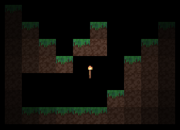

# 🚀 Light Implementation
A SDL2 Light basic implementation of light point.

The current code make a basic light like this: <br/>
 <br/>
I been working on this project to understand better about lights and shadows in 2D games.

## 📦 Instalation
📌 **Steps:**

1. Clone the repository.
2. Donwload mingw and SDL2.
3. Compile using this command:
    ```sh
    g++ ./main.cpp ./src/*.cpp -I"C:(SDL2_INCLUDE_PATH)" -L"C:(SDL2_LIB_PATH)" -lmingw32 -lSDL2main -lSDL2 -o app
4. Run the *app.exe*.